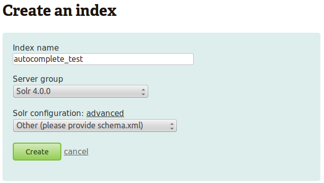

# Autocomplete with Solr

We are often asked through our support channels how to set up autocomplete with Solr. With Google and Bing offering smart, predictive suggestions for search, there are a growing number of devs, project managers, CEOs and the like looking to add similar functionality to their website. We thought it would be helpful to everyone to put this little HOWTO guide together and cover some examples.

In this document, we will not be focusing on setting up autocomplete with any particular backend. In otherwords, it doesn't matter if you're using Sunspot, Drupal, Wordpress, or your own homebrew code. If you want any moderately intelligent autocomplete functionality, you're going to need to write a little of your own code anyway.

Instead, we're going to cover the bases from scratch and keep the information and examples as simple as possible. We're also only going to look at using autocomplete in a web browser, via a website. That should give most people enough to go on to adapt their application. If you would like to suggest an alternative method, clone this git repository, add your thoughts, and send us a pull request. If you have any questions or issues, feel free to send us an email or open a support ticket.


## How autocomplete is covered in this document

There are a few different definitions of autocomplete. Generally, an interface that employs autocomplete  displays what it thinks the user may be about to type before the user types it. For our purposes here, we're going to be covering autocomplete in the context of search engines, as that is Solr's domain. Wikipedia actually sums it up nicely:

> ...[the] autocomplete user interface features provide users with suggested queries or results as they type their query in the search box. This is also commonly called *autosuggest* or *[incremental search](http://en.wikipedia.org/wiki/Incremental_search)*. This type of search often relies on matching algorithms that forgive entry errors such as phonetic [Soundex](http://en.wikipedia.org/wiki/Soundex) algorithms or the language independent [Levenshtein algorithm](http://en.wikipedia.org/wiki/Levenshtein_algorithm). The challenge remains to search large indices or popular query lists in under a few milliseconds so that the user sees results pop up while typing.

There are different strategies of deploying autocomplete. Both Google and Bing cross-reference partial queries with popular queries. This can be quick if you're looking for the same thing everyone else is, and enlightening/annoying/amusing if you're not. For example, if you're looking for "justice department," and your partial query is "justi," the autocomplete algorithm may suggest several queries related to Justin Beiber, Justin Timberlake and Justice League.

On the other hand, your company may not care to display what others are searching. Instead, you may want to match document titles or personnel. In that case, your autocomplete algorithm is much easier to create and deploy.


## What you need to know

Autocomplete is almost always an [AJAX](http://en.wikipedia.org/wiki/Ajax_%28programming%29) operation. In fact, if you're somehow not using AJAX, then you're doing things very wrong. This introduces some considerations for your application:

1. You will need to write some JavaScript. This shouldn't be too hard or complex. A simple script will be provided later on to get you started.

2. If your Solr server is different from your web host (ie, your website and Solr server are on different domains), then you will need to set up an http proxy. This is due to what's called "same-origin policy" in most browsers. This policy protects users from cross-site scripting (XSS) attacks by preventing client side scripts from loading content from another domain.

3. You may need to modify your schema by adding or tweaking some field types, as well as adding some new fields. You don't *necessarily* want your autocomplete suggestions to behave like your regular queries. For example, you may want autocomplete to match document titles exactly, but regular queries to match all fields in the document.

Keep these things in mind as you plan for implementing autocomplete. 

## First script

Let's start by creating a *very* basic autocomplete. This is going to have 6 elements:

1. A Solr index hosted by websolr

2. A very basic schema.xml

3. A curl script that posts some data to the websolr index.

4. An HTML page with a single text input and a div element that will hold the results the query generates

5. A JavaScript that uses AJAX to fetch the suggestions

6. A PHP file acting as the http proxy

### The websolr index

I created a Solr 4 index on websolr and used a custom schema (below). IT gave me a URL of http://index.websolr.com/solr/4d24e17b09c (feel free to test against this URL, but know that it's secured against updates).



### The schema

```xml
<?xml version="1.0" encoding="utf-8"?>
<schema name="Autocomplete EdgeNGrams Example" version="1.0">
  <types>
    <fieldType name="string" class="solr.StrField"  omitNorms="true" />
    <fieldtype name="text"   class="solr.TextField" positionIncrementGap="1">
      <analyzer>
        <tokenizer class="solr.StandardTokenizerFactory" />
        <filter    class="solr.StandardFilterFactory"    />
        <filter    class="solr.LowerCaseFilterFactory"   />
        <filter    class="solr.EdgeNGramFilterFactory" minGramSize="1" maxGramSize="15" side="front"/>
      </analyzer>
    </fieldtype>
  </types>
  <fields>
    <field name="id"         stored="true" type="string" multiValued="false" indexed="true" />
    <field name="title"      stored="true" type="text"   multiValued="true"  indexed="true" />
  </fields>
  <uniqueKey>id</uniqueKey>
  <defaultSearchField>title</defaultSearchField>
  <solrQueryParser defaultOperator="AND" />
</schema>
```

### The data

I ran a curl command to populate the index. For fun, I populated it with titles of canceled TV shows:

```bash
curl http://index.websolr.com/solr/4d24e17b09c/update -H "Content-type: text/xml" --data-binary '<add><doc><field name="id">1</field><field name="title">Dexter</field></doc><doc><field name="id">2</field><field name="title">Futurama</field></doc><doc><field name="id">3</field><field name="title">Breaking Bad</field></doc><doc><field name="id">4</field><field name="title">Burn Notice</field></doc><doc><field name="id">5</field><field name="title">Life</field></doc><doc><field name="id">6</field><field name="title">Space Ghost</field></doc><doc><field name="id">7</field><field name="title">The Brak Show</field></doc><doc><field name="id">8</field><field name="title">Cops</field></doc><doc><field name="id">9</field><field name="title">Home Movies</field></doc><doc><field name="id">10</field><field name="title">Captain Planet</field></doc></add>';
```

### The HTML:

```html
<!DOCTYPE html>
<html>
	<head>
		<title>Autocomplete Example #1</title>
		<script type="text/javascript" src="script.js"></script>
		<meta content="text/html;charset=utf-8" http-equiv="Content-Type">
		<meta content="utf-8" http-equiv="encoding">
	</head>
	<body>
		<center>
			Query:
			<form autocomplete="off" onsubmit="return false;">
				<input type="text" name="query" id="query" onkeyup="updateTerms();" />
			</form>
			Suggestions:
			<div id="suggestions" style="background-color:#FFFFCC;width:300px;"></div>
		</center>
	</body>
</html>
```

### The JavaScript:

```javascript
function updateTerms() {
	var user_query  = document.getElementById('query').value;
	if (user_query) {
		var xmlhttp;
		var response;
		var url = 'proxy.php?q='+encodeURIComponent(user_query);
		if (window.XMLHttpRequest)	{
			// code for IE7+, Firefox, Chrome, Opera, Safari
			xmlhttp=new XMLHttpRequest();
		}
		else {
			// code for IE6, IE5
			xmlhttp=new ActiveXObject("Microsoft.XMLHTTP");
		}

		xmlhttp.onreadystatechange=function() {
			if (xmlhttp.readyState==4 && xmlhttp.status==200) {
			    try{
			        var data = JSON.parse(xmlhttp.responseText);
			    }catch(e){
			        alert("Failed to parse data from server:\n"+xmlhttp.responseText);
			    }
				printList(data);
			}
		}
		xmlhttp.open("GET",url,true);
		xmlhttp.send();
	}
	else {
		document.getElementById('suggestions').innerHTML= "";
	}
}

function printList(data) {
	var results      = data.response.numFound;
	var titles       = "";
	for (var item in data.response.docs) {
		title = data.response.docs[item].title;
		titles = titles + title + '<br />';
	}
	if (!results) {
		titles = "No titles found";
	}
	document.getElementById('suggestions').innerHTML= titles;
}
```

### The Proxy:

```php
<?php
	$q = (in_array('q', array_keys($_GET))) ? $_GET['q'] : '';
	$url = 'http://index.websolr.com/solr/4d24e17b09c/select?q=title:"' . urlencode($q) . '"&sort=score+desc&defType=edismax&wt=json';
	$handle = fopen($url, "r");
	if ($handle) {
	    while (!feof($handle)) {
	        $buffer = fgets($handle, 4096);
	        echo $buffer;
	    }
	    fclose($handle);
	}
	exit();
?>
```

### Testing out the example:

Place these files on to your server or localhost and open up index.html. Enter some letters into the input field and see the results that are displayed in yellow.


This is, obviously, an overly simplistic model. It is the bare minimum that needs to be in place in order for autocomplete to work. However, using this as a codebase, we can expand a bit a get a little more fancy.