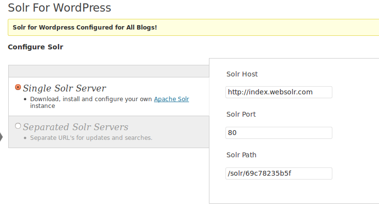

# Configuring Drupal 7 with the ApacheSolr module

In this guide, we're going to cover the basics of setting up a websolr index to be used with [Wordpress](http://wordpress.org/) and the [Solr for Wordpress](http://wordpress.org/plugins/solr-for-wordpress/) plugin. 

## Getting started

For the purposes of this tutorial, I set up a vanilla Wordpress install downloaded the [Solr for Wordpress](http://wordpress.org/plugins/solr-for-wordpress/) plugin. Other than that, I did not add or change any settings along the way. Your situation is probably different, but it shouldn't matter at this point.

The first step is to log into your administrative dashboard.

Navigate to Plugins > Add New.

Search the repository for "Solr for Wordpress." The plugin should be the first one listed. Click "Install Now"

You may get a screen asking you to fill in your FTP credentials. If so, simply add in the information, or ask your internet provider to tell you what it is. You can also [upload manually](http://codex.wordpress.org/Managing_Plugins#Manual_Plugin_Installation). When the installation has finished, activate the new plugin

You can now edit the plugin settings by navigating to Settings > Solr Options

## Setting up the websolr index

Next, you'll want to open up websolr in a new tab and [add a new slice](https://websolr.com/slices/new) to your account. Give your index a descriptive name, select the server group nearest to your application, then select "Solr for Wordpress" for the Index type:

When this form has been filled out, go ahead and click "Create." Afterwards, you will be redirected to a page that shows the status of your index and will probably show a message about taking a few minutes to complete:

If you see a message that says your index looks ok, you're done. Occasionally provisioning errors will occur and you will see a message about taking a long time to provision your index. Try appending "/refreshing" to the page's URL and give it a minute or two. If that doesn't clear things up, you will need to open a [support ticket](http://help.websolr.com) and have the Support Team take a closer look.

## Setting up the ApacheSolr Module

Once your websolr index is up and running, switch back to your Wordpress tab. If you haven't already, navigate to the Solr options page where you should see something like this:

To connect your Wordpress site to websolr, you will want to configure a single Solr server, and use the information supplied in the image above. The only difference is the "Solr Path," where you will use your unique 11-character key. Scroll down to the bottom of this page and click "Save Changes." You should now get a "Success!" message:

A couple points here. If you click on "Check Server Settings," you will probably get an error that says "Ping failed!" That is not a bug or an indication that anything is wrong. It has to do with the plugin trying to access some administrative functions that websolr blocks for security reason. It will not affect search performance.

## Checking on your index

If you have a plain installation (like me, in this example), go ahead and create a post:

Give your post some fun content:

Interestingly, when we were evaluating this plugin, we noticed that it generated network traffic to the Solr instance even before the user clicks on "Save" or "Publish." In fact, as of this writing, just giving the post a title is enough to cause the data to be sent to the websolr URL. The document will be updated in the Solr instance whenever the document is autosaved. It's unclear whether this is a bug or a feature, but definitely something to keep in mind.

Once you have published your work, you can navigate to your websolr index and see something like this:

If you already have a large number of documents in Wordpress, you can instruct the Solr plugin to synchronize your local database with your websolr index by navigating to Settings > Solr Options and clicking on "Load All Pages," "Load All Posts," then "Optimize Index."

Keep in mind that all indexes on our shared clusters are provisioned with a 60s autoCommit setting. That means it could take up to 60s for your changes to become visible. If you index one or more documents, wait a few minutes before checking to see if they're in your index. Of course, if you have any issues with this, please feel free to open a [support ticket](http://help.websolr.com) and have the Support Team take a closer look.